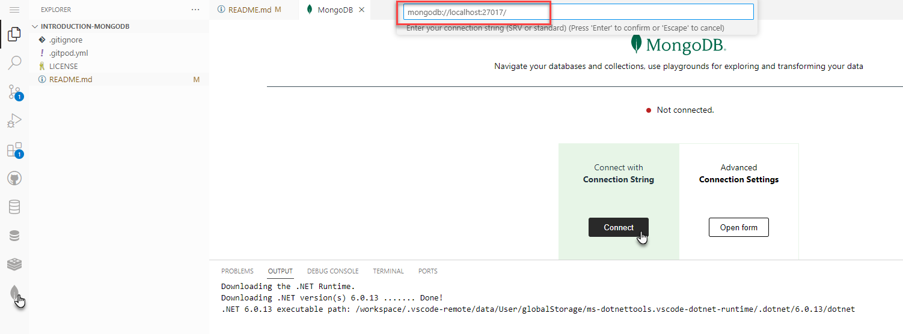
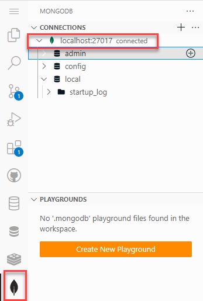
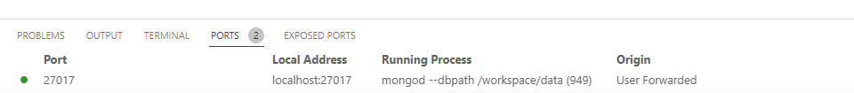

# Introduction to MongoDB - Create and Query Data

Assumption: running in Gitpod workspace: [](https://gitpod.io/#https://github.com/lucasjellema/introduction-mongodb); this workspace contains MongoDB, mongosh (MongoDB Shell), VS Code with MongoDB Extension. 

## Work with MongoDB Shell (mongosh)

First we will work with the simple straightforward CLI for MongoDB. 

### First steps with shell

Open shell: 

```
mongosh
```

To display the database you are using, type `db`. The operation should return test, which is the default database.

To list the databases available to the user, use `show dbs`.

To create a new database, issue the `use <db>` command with the database that you would like to create. For example, the following commands create both the database *myNewDatabase* and the collection *myCollection* using the insertOne()
operation:

```
use myNewDatabase
db.myCollection.insertOne( { x: 1 } );
```
Check result of creating collection and document:

```
db.myCollection.find();
```

Update document with:

```
db.myCollection.updateOne(
   { x: 1 },
   {
     $set: { "y": "2", status: "P" },
   }
)
// check result
db.myCollection.find();
```

Add documents with:

```
db.myCollection.insertMany([
   {  x: 10, y:20, extra_field: "special", status: "X" }, 
   {  x: 15, y:200, my_field:true, extra_field: "special", status: "Y" },
   {  x: 20, y:200, my_field: "red", status: "Z" } 
   ]);
// check result
db.myCollection.find();

```

To remove documents, use the deleteOne or deleteMany operation. This statement removes all documents that have their status field set to X. That could be zero, one or many documents.

```
db.myCollection.deleteMany({ status : "X" })

// check result
db.myCollection.find();

```

See docs: [Mongo DB Shell- Run Commands](https://www.mongodb.com/docs/mongodb-shell/run-commands/)

# More interesting queries

Using an almost classic set of data - with employees and departments - that was abundantly used in the early days of Oracle Database to demonstrate the power of SQL we will now take a closer look at NoSQL. First we have to load the data into MongoDB from two csv files. 

## Load Data
Let's load a data Set from CSV files into MongoDB

Directory hr-queries contains the data sets in two CSV files: *export_dept.csv* and *export_emp.csv*. These are classic datasets for anyone with a history in the world of Oracle. Two helper files - *empFields.txt* and *deptFields.txt* – specify how the *mongoimport* utility should map the fields in each record to document properties in the MongoDB collection.

Using the following commands – running the monogimport tool in a new terminal window  – you import the datasets into collections *emp* and *dept* in database called *hr*. The database and the collections will be dropped (if they already exist) and (re)created through these commands.

Note: using MongoDB Compass - the Desktop GUI for MongoDB, discussed later on in this tutorial - you could also import the CSV documents into a new database.

```
cd /workspace/introduction-mongodb/hr-queries

mongoimport --host 127.0.0.1:27017 --db hr --collection emp --drop --file export_emp.csv  --type csv --fieldFile empFields.txt

mongoimport --host 127.0.0.1:27017 --db hr --collection dept --drop --file export_dept.csv  --type csv --fieldFile deptFields.txt
```

### Querying Data

Start the MongoDB shell as you have done before.

```
mongosh
```

Switch to database hr:

```
use hr
```

Verify whether the collections were created:
```
show collections
```

Check the statistics for collection emp:
```
db.emp.stats()
```
Check the contents for both collections:
```
db.emp.find()
db.dept.find()
```

Using the inclusion projection mask, list all documents without returning _id and COMM:

```
db.emp.find(
  {}
, {EMPNO:1,ENAME:1,JOB:1,MGR:1,HIREDATE:1,SAL:1,DEPTNO:1, _id:0}
)
```

Let’s find the names of all managers:

```
db.emp.find({"JOB":"MANAGER"},{ENAME:1})
```

Find the names and salaries of all managers
```
db.emp.find( {"JOB":"MANAGER"} ,{ENAME:1, SAL:1} )
```

This query filters documents on their JOB field, only selecting field values equal to "MANAGER". From all documents, only the ENAME field is to be returned.
```
db.emp.find({"JOB":"SALESMAN"},{ENAME:1, SAL:1}).sort({'SAL':-1}) 
```


And – find all salesmen, listed by salary descending; only show top 2

```
db.emp.find({"JOB":"SALESMAN"},{ENAME:1, SAL:1}).sort({'SAL':-1}).limit(2)
```

Find all employees who are not in department 10, with their name and salary and sorted alphabetically by name
```
db.emp.find({"DEPTNO":{$ne: 10} },{ENAME:1, SAL:1, DEPTNO:1}).sort({'ENAME':1})
```

Name and salary of two highest earning Salesmen – best paid first
```
db.emp.find( {"JOB":"SALESMAN"}, { ENAME:1, SAL:1}).sort( {'SAL':-1}).limit(2)
```

Aggregation of records - in groups or over all selected documents - is done using an aggregation pipeline in MongoDB. Here is an example of retrieving total salary sum, total number of employees, the highest salary over all documents:
```
db.emp.aggregate(
[{
     $group: {
        _id: null,
          total_salary_sum: { $sum: "$SAL" }
        , total_staff_count: { $sum: 1 }
        , max_sal: { $max: "$SAL" }
     }
   }
]
)
```

And here is a similar query, this time getting aggregate values per department:
```
db.emp.aggregate(
[{
     $group: {
        _id: "$DEPTNO",
          total_salary_sum: { $sum: "$SAL" }
        , total_staff_count: { $sum: 1 }
        , max_sal: { $max: "$SAL" }
     }
   }
]
)
```

Here an example of departments filtered by the aggregated results - only returbn departments with at least 2 employees:
```
db.emp.aggregate(
[{
     $group: {
        _id: { deptno: "$DEPTNO", hireyear : {  $year: "$startdate"} },
          total_salary_sum: { $sum: "$SAL" }
        , total_staff_count: { $sum: 1 }
        , max_sal: { $max: "$SAL" }
     }
   }
,   { $match: { total_staff_count: { $gt: 1 } } }
]
)
```

Introducing lookup in MongoDB: list all employees (empno and ename) along with the looked up department

```
db.emp.aggregate(
[  {$lookup:
      {
         from:"dept",
         localField:"DEPTNO",
         foreignField:"deptno",
         as:"departments"
     }
   }  
, {$project: {
        "EMPNO": 1,
        "ENAME": 1,
        "DEPT": { $arrayElemAt:["$departments", 0]},
      }
    }
]
)
```

JavaScript functions can be embedded in statements, for example for field value calculation or to provide a complex where clause. See [docs on function](https://www.mongodb.com/docs/v6.0/reference/operator/aggregation/function/)


Add a simple derived field using this function that calculates the total income using salary and commission:

```
db.emp.aggregate( [
   { $addFields:
      {
        income:
            { $function:
               {
                  body: function(sal, comm) {
                     return parseInt(sal + comm)
                  },
                  args: [ "$SAL", "$COMM" ],
                  lang: "js"
               }
            }
       }
    }
] )
```

See this example where employees are searched who earn more than the salarycap set for their particular job, using a custom function to determine if a salary is higher than allowed.

```
db.emp.find( { $where: function() {
   const caps = {'CERK':1000, 'ANALYST':3500 , 'SALESMAN': 2000, 'MANAGER':2500}
   cap_for_job = caps[this.JOB]? caps[this.JOB] : 10000
   return this.SAL > caps[this.JOB]
  } 
});
```

Combine lookup with filter: find every employee working in New York by first looking up the department for each employee and the filtering on a department field. This is not superperforming.

```
-- all employees who work in NEW YORK (after adding DEPT through lookup to each EMP)
db.emp.aggregate(
[  {$lookup:
      {
         from:"dept",
         localField:"DEPTNO",
         foreignField:"deptno",
         as:"dept"
     }
   }  
, {$project: {
        "EMPNO": 1,
        "ENAME": 1,
        "DEPT": { $arrayElemAt:["$dept", 0]},
      }
    }
, {$match: {  "DEPT.loc" :"NEW YORK"} }
]
)
```

A somewhat more elaborate aggregation example: find employee KING and all his subordinates (people who have their MGR field set to the EMPNO value for KING - a classic foreign key).

```
db.emp.aggregate(
[ 
 {$match: { ENAME: "KING"}}
, {$lookup:
      {
         from:"emp",
         localField:"EMPNO",
         foreignField:"MGR",
         as:"subordinates"
     }
   }  
, {$project: {
        "EMPNO": 1,
        "ENAME": 1,
        "subordinates": 1,
        // "firstStaff": { $arrayElemAt:["$staff", 0]},
        "staff": { $reduce: {
                            input: "$subordinates",
                            initialValue: "",
                            in: { $concat : ["$$value", ", ","$$this.ENAME"] }
                           }
                 },
      }
    }
]
)
```

### Geo Spatial

Add geospatial data for departments (longitude, lattitude)


```
db.dept.findAndModify({
    query: { loc: "NEW YORK" },
    update: { $set: { "location" : {
                         "type" : "Point",
                         "coordinates" : [ -73.935242, 40.730610 ]                         
                         } 
             } },
    upsert: true
})

db.dept.findAndModify({
    query: { loc: "DALLAS" },
    update: { $set: { "location" : {
                         "type" : "Point",
                         "coordinates" : [ -96.8005, 32.7801 ]                         
                         } 
             } },
    upsert: true
})

db.dept.findAndModify({
    query: { loc: "BOSTON" },
    update: { $set: { "location" : {
                         "type" : "Point",
                         "coordinates" : [ -71.0598, 42.3584 ]                         
                         } 
             } },
    upsert: true
})

db.dept.findAndModify({
    query: { loc: "CHICAGO" },
    update: { $set: { "location" : {
                         "type" : "Point",
                         "coordinates" : [ -87.6298, 41.8781 ]                         
                         } 
             } },
    upsert: true
})
``` 

Create geo-spatial index on location field:
``` 
db.dept.ensureIndex( { location : "2dsphere" } );
```

Find departments within 500 km from Washington DC ( [ -77.0364, 38.8951 ])
-- NOTE: the $near operator requires an index.

```
db.dept.find(
  {
    location : {
      $near : {
        $geometry : { 
          type : "Point" , 
          coordinates : [ -77.0364, 38.8951 ] 
        }, 
        $maxDistance : 500000
      }
    }
  }
 )   
``` 
To also get the distance from Washington DC to the department(s), use aggregation with $geoNear. We find all points within 500000 meter from Washington DC and get the distance for each department in the property distanceFromTarget, in km (because of the distanceMultiplier that converts from meter to kilometer)

```
db.dept.aggregate([
    { "$geoNear": {
        "near": {
            "type": "Point",
            "coordinates": [ -77.0364, 38.8951 ] 
        }, 
        "maxDistance": 500000,
        "spherical": true,
        "distanceField": "distanceFromTarget",     
        "distanceMultiplier": 0.001
     }}
]).pretty()
```

To list all departments, ordered by their distance from Washington DC 
```
db.dept.aggregate([
    { "$geoNear": {
        "near": {
            "type": "Point",
            "coordinates": [ -77.0364, 38.8951 ] 
        }, 
        "spherical": true,
        "distanceField": "distanceFromTarget",     
        "distanceMultiplier": 0.001
     }}
 , {$sort : {"distanceFromTarget":1}}
,  {$project: {
        _id: 0,
        dname: 1,
        loc: 1,
        "distance from Washington DC": { $trunc : "$distanceFromTarget"},
    }
   }
])
```

### Text Search

MongoDB's text search capability supports query operations that perform a text search of string content. To perform text search, MongoDB uses a text index and the $text operator. For details over text search [MongoDB Text Search documents](https://www.mongodb.com/docs/manual/text-search/)

To try out the text search, first prepare documents with some unstructured text data. Then create a Text index and search using fuzzy, rich text evaluation.

#### Add Text Field 

```
db.emp.findAndModify({
    query: { ENAME: "KING" },
    update: { $set: { "bio" : "Gerald Ford was born on July 14, 1913, in Omaha, Nebraska, as Leslie Lynch King Jr. In just weeks, he was whisked away by his mother, Dorothy Ayer Gardner, to her parents' home in Grand Rapids, Michigan. A plucky woman who would not tolerate abuse, she divorced his father, Leslie Lynch King Sr., within the year, and less than three years later, was married to Gerald Rudolff Ford, a local paint company salesman, from whence Jerry Jr. got his name—although it was not made legal until he was 22 years old. A star college football player, he served in the Navy during WWII. Elected to the House of Representatives in 1948, Ford represented Michigan's 5th District for nearly 25 years before suddenly finding himself at the crossroads of history. He was elevated to vice president, and then became the 38th U.S. president due to Richard Nixon's involvement in the Watergate scandal and subsequent resignation. Ford was defeated by Jimmy Carter in the 1976 election. He died in California in 2006." }
            },
    upsert: true
})


db.emp.findAndModify({
    query: { ENAME: "BLAKE" },
    update: { $set: { "bio" : "Jamaican sprinter Yohan Blake holds the world record for the 4-by-100-meter relay. In 2012, he won a silver medal in both the 100-meter and 200-meter races, losing to rival and fellow Jamaican Usain Bolt in both events. Famed sprinter Yohan Blake, nicknamed 'The Beast' by fans, was born on December 26, 1989 in St. James, Jamaica. Blake began running competitively in the 100 and 200 meters at a young age. In 2009, he tested positive for methylaxanthine at the Jamaican Championships, and was banned for three months. He has since won various honors, including two gold medals at the 2011 World Championships, in the 100 and the 4-by-100-meter relay. Blake holds the record in the 4-by-100-meter relay and the national junior record in the 100. His best time in the 100 is 9.75 seconds. At the 2012 Summer Olympics, he won a silver medal in the 100 meters with a time of 9.75 seconds, just shy of his rival Usain Bolt's 9.63 seconds. Similarly, in the 200-meter race, Blake finished second to Bolt, taking the silver." }
            },
    upsert: true
})

db.emp.findAndModify({
    query: { ENAME: "FORD" },
    update: { $set: { "bio" : "Harrison Ford is one of Hollywood's leading men, with an acting career that has spanned nearly 40 years and included iconic roles such as Indiana Jones and Han Solo." }
            },
    upsert: true
})

db.emp.findAndModify({
    query: { ENAME: "JONES" },
    update: { $set: { "bio" : "Tom Jones is a Welsh rock, pop and soul singing legend best known as an international hit maker over the last five decades. His popular singles include \"It's Not Unusual,\" \"Green Green Grass of Home,\" \"Delilah,\" \"Till\" and \"A Boy From Nowhere.\"" }
            },
    upsert: true
})

db.emp.findAndModify({
    query: { ENAME: "ADAMS" },
    update: { $set: { "bio" : "American Founding Father Samuel Adams helped organize the Boston Tea Party and signed the U.S. Declaration of Independence. Samuel Adams was born on September 27, 1722, in Boston, Massachusetts. A strong opponent of British taxation, Adams helped formulate resistance to the Stamp Act and played a vital role in organizing the Boston Tea Party. He was a second cousin of U.S. President John Adams, with whom he urged a final break from Great Britain, and a signee of the U.S. Declaration of Independence. Adams died on October 2, 1803, in Boston." }
            },
    upsert: true
})

db.emp.findAndModify({
    query: { ENAME: "JAMES" },
    update: { $set: { "bio" : "King James IV unified Scotland under his rule, provided laws, advanced culture and learning and positioned the country as a major player in European politics. King of Scotland from 1488 to 1513, James IV unified the country under his rule through enforcement and political and cultural advancements. While Scotland had a tense relationship with England under King Henry VII, relations improved with James’s marriage to Henry’s daughter, Margaret Tudor. The tide reversed when James allied himself with England’s arch enemy, France, and went to war with Henry VIII. James was killed in the Battle of Flodden on September 9, 1513." }
            },
    upsert: true
})

db.emp.findAndModify({
    query: { ENAME: "MILLER" },
    update: { $set: { "bio" : "Bandleader Glenn Miller inspired the World War II generation and boosted morale with many popular songs. Born in 1904 in Iowa, bandleader and musician Glenn Miller inspired the World War II generation. He was one of the most popular bandleaders in the late 1930s and early 1940s with such songs as \"Moonlight Serenade\" and \"Tuxedo Junction.\" In 1942, Miller enlisted in the U.S. Army and was assigned to lead the Army Air Force Band. He boosted the morale of the troops with his many popular songs before mysteriously disappearing on a flight from England to Paris, France. Miller's original recordings continue to sell millions of copies. He died on December 15, 1944." }
            },
    upsert: true
})
```


#### Create text index 

The text index is created over three fields that each contain a form of text. The fields are assigned different weights in the index.
```
db.emp.createIndex(
{ ENAME:'text', 
  JOB:'text',
  BIO:'text',
}
,{  weights: { ENAME:10, JOB:5, bio:1}
  , name: 'employee_text_index'  
}
)
```

#### Search using text index

Which employees are found when looking for someone to lead? And what about acting? or managing?
```
db.emp.find({$text: {$search: 'lead'}},{ENAME:1})
```

Which employees are found for the search string Ford? (one is obvious, the other less so). (note: when looking for fording or forded or fords, the same results are retrieved, thanks to stemming) 
```
db.emp.find({$text: {$search: 'ford'}},{ENAME:1})
```

Text search scores
```
db.emp.aggregate(
     [
         { $match: { $text: { $search: 'managing' } } },
         { $project: {_id:0,ENAME: 1, score: { $meta: 'textScore' } } },
         { $sort: {score:-1} }
     ]
 )
db.emp.aggregate(
     [
         { $match: { $text: { $search: 'king' } } },
         { $project: {_id:0,ENAME: 1, score: { $meta: 'textScore' } } },
         { $sort: {score:-1} }
     ]
 )
```

Check out how much more than scores than the other when looking at the text scores 

```
 db.emp.aggregate(
     [
         { $match: { $text: { $search: 'forded' } } },
         { $project: {_id:0,ENAME: 1, score: { $meta: 'textScore' } } },
         { $sort: {score:-1} }
     ]
 )
```


Note: You can compare the MongoDB search commands with their SQL counterparts in the presentation: https://www.slideshare.net/lucasjellema/comparing-30-mongodb-operations-with-oracle-sql-statements .


## Connect to the Local MongoDB instance

Click on the MongoDB extension icon in VS Code toolbar. Then click on the Connect button. 

  

Connect the MongoDB VS Code Extension to the local MongoDB database using this connection string: `mongodb://localhost:27017/` . Paste your connection string  `mongodb://localhost:27017/` into the Command Palette. Press the Enter or Return key.

You will now be connected. The connection is presented in the explorer and can be expanded to peek inside the database.

  

Check the docs: [MongoDB for VS Code - Connect to Your MongoDB Deployment](https://www.mongodb.com/docs/mongodb-vscode/connect/)


## Navigate the data

Check the docs: [Navigate Your Data](https://www.mongodb.com/docs/mongodb-vscode/databases-collections/)

## Using MongoDB Compass GUI

Mongo Compass is a very nice and free GUI tool that allows you to work with MongoDB - for operational database management and for data analysis, querying and manipulation. Let's work with Compass for a moment - a welcome change from the shell. Compass runs as a native desktop application and can connect to local and remote MongoDB instances. Compass is available for Windows, MacOS and Linux. 

Download and install the appropriate version for your platform: [MongoDB Tools Download page](https://www.mongodb.com/try/download/compass)

In order to connect to the MongoDB instance running in your Gitpod workspace, you have connect your local VS Code over SSH to the remote workspace (see next section). Once that is done, the connection to the MongoDB instance can be made from Compass using the local connectstring `mongodb://localhost:27017/`.

### Run Local VS Code with Gitpod workspace

Try to open a workspace in your local VS Code desktop for the smoothest dev experience (using port forwarding for services and web applications). 


You need the MS Remote SSH extension for VS Code:


Also install the VS Code extension Gitpod Remote


Open the command palette in VS Code in the browser. Select: *Gitpod - Open in VS Code*.


You will be asked:
* Open Visual Studio Code?
* Copy the this temporary password
* Allow an extension to open this URL?
* Enter password for remote connection

as shown in this picture.


Please comply and provide as requested.

You can now work locally against the CDE (Cloud Development Environment) - the cloud based Gitpod workspace environment. Try to type in the local editor and quickly check the browser based editor - and vice versa. Be really quick! They seem pretty well synchronized.

The MongoDB port (27017) that is opened in the workspace is forwarded. This means that when you access `localhost:27017` on your laptop, the requests are forwarded correctly over the SSH connection to the Gitpod workspace environment, ending up on the MongoDB instance running in the workspace.

This figure shows the port-forwarding configuration in your local VS Code

  

Note: Check the Ports tab in your local VS Code; it could be that the local port is not the same as the port on the Gitpod workspace; I have seen local port 27018 forwarded to remote port 27017 for example. If that is the case for you as well, then you have to connect Compass at `localhost:27018`.

### First steps with Compass

Connect


List databases
List collections
Show documents